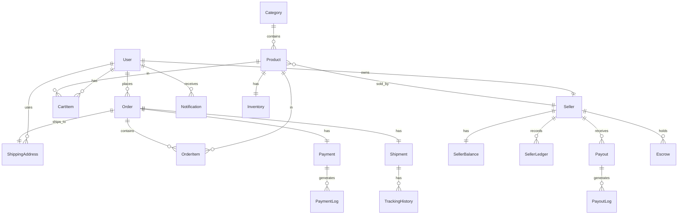

# Database Schema

## Overview

The database uses PostgreSQL with Prisma ORM. The schema supports multi-vendor e-commerce with seller management, payment processing, and logistics tracking.

## Entity Relationship Diagram

## Tables

### User
Stores user account information with role-based access control.

**Fields:**
- `id` (UUID, Primary Key)
- `email` (String, Unique)
- `password` (String, Hashed)
- `name` (String)
- `role` (Enum: CUSTOMER, SELLER, ADMIN)
- `phone` (String, Optional)
- `createdAt` (DateTime)
- `updatedAt` (DateTime)

### Role
Defines user roles for authorization.

**Fields:**
- `id` (UUID, Primary Key)
- `name` (Enum: CUSTOMER, SELLER, ADMIN)
- `description` (String)

### Category
Product categories for organization.

**Fields:**
- `id` (UUID, Primary Key)
- `name` (String, Unique)
- `slug` (String, Unique)
- `description` (String, Optional)
- `createdAt` (DateTime)
- `updatedAt` (DateTime)

### Product
Product catalog items.

**Fields:**
- `id` (UUID, Primary Key)
- `name` (String)
- `slug` (String, Unique)
- `description` (String)
- `price` (Decimal)
- `categoryId` (UUID, Foreign Key)
- `sellerId` (UUID, Foreign Key)
- `stock` (Integer)
- `images` (String Array)
- `isActive` (Boolean)
- `createdAt` (DateTime)
- `updatedAt` (DateTime)

### Inventory
Product inventory tracking.

**Fields:**
- `id` (UUID, Primary Key)
- `productId` (UUID, Unique, Foreign Key)
- `quantity` (Integer)
- `reserved` (Integer)
- `available` (Integer)
- `lowStockThreshold` (Integer)
- `createdAt` (DateTime)
- `updatedAt` (DateTime)

### Order
Customer orders.

**Fields:**
- `id` (UUID, Primary Key)
- `userId` (UUID, Foreign Key)
- `orderNumber` (String, Unique)
- `status` (Enum: PENDING, PAID, PROCESSING, SHIPPED, OUT_FOR_DELIVERY, DELIVERED, CANCELLED, RETURNED, FAILED)
- `subtotal` (Decimal)
- `tax` (Decimal)
- `shipping` (Decimal)
- `discount` (Decimal)
- `total` (Decimal)
- `currency` (String)
- `notes` (String, Optional)
- `createdAt` (DateTime)
- `updatedAt` (DateTime)

### OrderItem
Items within an order.

**Fields:**
- `id` (UUID, Primary Key)
- `orderId` (UUID, Foreign Key)
- `productId` (UUID, Foreign Key)
- `quantity` (Integer)
- `price` (Decimal)
- `total` (Decimal)
- `createdAt` (DateTime)

### Payment
Payment transactions.

**Fields:**
- `id` (UUID, Primary Key)
- `orderId` (UUID, Unique, Foreign Key)
- `paymentIntentId` (String, Unique)
- `amount` (Decimal)
- `currency` (String)
- `status` (Enum: PENDING, PROCESSING, COMPLETED, FAILED, REFUNDED)
- `clientSecret` (String, Optional)
- `metadata` (JSON, Optional)
- `createdAt` (DateTime)
- `updatedAt` (DateTime)

### PaymentLog
Payment transaction logs.

**Fields:**
- `id` (UUID, Primary Key)
- `paymentId` (UUID, Foreign Key)
- `event` (String)
- `status` (String)
- `message` (String, Optional)
- `metadata` (JSON, Optional)
- `createdAt` (DateTime)

### ShippingAddress
Customer shipping addresses.

**Fields:**
- `id` (UUID, Primary Key)
- `userId` (UUID, Foreign Key)
- `orderId` (UUID, Unique, Foreign Key, Optional)
- `fullName` (String)
- `addressLine1` (String)
- `addressLine2` (String, Optional)
- `city` (String)
- `state` (String)
- `postalCode` (String)
- `country` (String)
- `phone` (String)
- `isDefault` (Boolean)
- `createdAt` (DateTime)
- `updatedAt` (DateTime)

### Seller
Seller accounts.

**Fields:**
- `id` (UUID, Primary Key)
- `userId` (UUID, Unique, Foreign Key)
- `businessName` (String)
- `businessEmail` (String)
- `businessPhone` (String, Optional)
- `taxId` (String, Optional)
- `bankAccount` (String, Optional)
- `bankName` (String, Optional)
- `isVerified` (Boolean)
- `isActive` (Boolean)
- `createdAt` (DateTime)
- `updatedAt` (DateTime)

### SellerBalance
Seller balance tracking.

**Fields:**
- `id` (UUID, Primary Key)
- `sellerId` (UUID, Unique, Foreign Key)
- `pending` (Decimal)
- `available` (Decimal)
- `locked` (Decimal)
- `paid` (Decimal)
- `createdAt` (DateTime)
- `updatedAt` (DateTime)

### SellerLedger
Seller transaction ledger.

**Fields:**
- `id` (UUID, Primary Key)
- `sellerId` (UUID, Foreign Key)
- `type` (String)
- `amount` (Decimal)
- `balance` (Decimal)
- `description` (String)
- `referenceId` (String, Optional)
- `metadata` (JSON, Optional)
- `createdAt` (DateTime)

### Escrow
Seller escrow holdings.

**Fields:**
- `id` (UUID, Primary Key)
- `sellerId` (UUID, Foreign Key)
- `orderId` (UUID, Foreign Key, Optional)
- `amount` (Decimal)
- `status` (Enum: PENDING, AVAILABLE, LOCKED, PAID)
- `releaseAt` (DateTime)
- `releasedAt` (DateTime, Optional)
- `createdAt` (DateTime)
- `updatedAt` (DateTime)

### Payout
Seller payouts.

**Fields:**
- `id` (UUID, Primary Key)
- `sellerId` (UUID, Foreign Key)
- `amount` (Decimal)
- `status` (Enum: PENDING, PROCESSING, COMPLETED, FAILED)
- `bankAccount` (String)
- `bankName` (String)
- `referenceId` (String, Optional)
- `failureReason` (String, Optional)
- `retryCount` (Integer)
- `nextRetryAt` (DateTime, Optional)
- `createdAt` (DateTime)
- `updatedAt` (DateTime)

### PayoutLog
Payout transaction logs.

**Fields:**
- `id` (UUID, Primary Key)
- `payoutId` (UUID, Foreign Key)
- `status` (String)
- `message` (String, Optional)
- `metadata` (JSON, Optional)
- `createdAt` (DateTime)

### Shipment
Shipping information.

**Fields:**
- `id` (UUID, Primary Key)
- `orderId` (UUID, Unique, Foreign Key)
- `trackingNumber` (String, Unique)
- `awb` (String, Optional)
- `shipmentId` (String, Optional)
- `pickupId` (String, Optional)
- `courierName` (String, Optional)
- `shippingLabelUrl` (String, Optional)
- `estimatedDelivery` (DateTime, Optional)
- `status` (Enum: PENDING, PICKED_UP, IN_TRANSIT, OUT_FOR_DELIVERY, DELIVERED, FAILED, RETURNED)
- `weight` (Decimal)
- `length` (Decimal)
- `width` (Decimal)
- `height` (Decimal)
- `shippingCost` (Decimal)
- `warehousePincode` (String)
- `destinationPincode` (String)
- `createdAt` (DateTime)
- `updatedAt` (DateTime)

### TrackingHistory
Shipment tracking updates.

**Fields:**
- `id` (UUID, Primary Key)
- `shipmentId` (UUID, Foreign Key)
- `status` (String)
- `location` (String, Optional)
- `description` (String, Optional)
- `timestamp` (DateTime)

### Notification
User notifications.

**Fields:**
- `id` (UUID, Primary Key)
- `userId` (UUID, Foreign Key)
- `title` (String)
- `message` (String)
- `type` (String)
- `isRead` (Boolean)
- `createdAt` (DateTime)

### EmailQueue
Queued email notifications.

**Fields:**
- `id` (UUID, Primary Key)
- `to` (String)
- `subject` (String)
- `template` (String)
- `data` (JSON)
- `status` (String)
- `attempts` (Integer)
- `sentAt` (DateTime, Optional)
- `error` (String, Optional)
- `createdAt` (DateTime)
- `updatedAt` (DateTime)

### IdempotencyKey
Idempotency keys for preventing duplicate operations.

**Fields:**
- `id` (UUID, Primary Key)
- `key` (String, Unique)
- `response` (JSON)
- `createdAt` (DateTime)
- `expiresAt` (DateTime)

### AuditLog
System audit trail.

**Fields:**
- `id` (UUID, Primary Key)
- `userId` (UUID, Foreign Key, Optional)
- `action` (String)
- `entity` (String)
- `entityId` (String, Optional)
- `changes` (JSON, Optional)
- `ipAddress` (String, Optional)
- `userAgent` (String, Optional)
- `createdAt` (DateTime)

## Indexes

All tables have appropriate indexes on:
- Primary keys
- Foreign keys
- Unique constraints
- Frequently queried fields (email, orderNumber, trackingNumber)

## Data Integrity

- Foreign key constraints ensure referential integrity
- Unique constraints prevent duplicate records
- Check constraints validate data ranges
- Transactions ensure atomic operations
